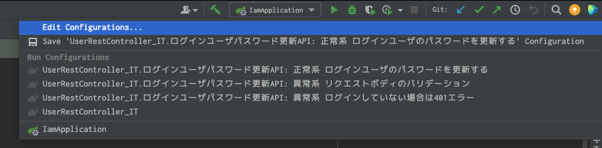
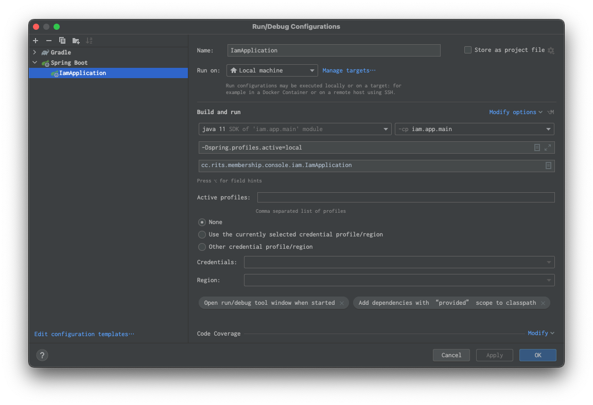
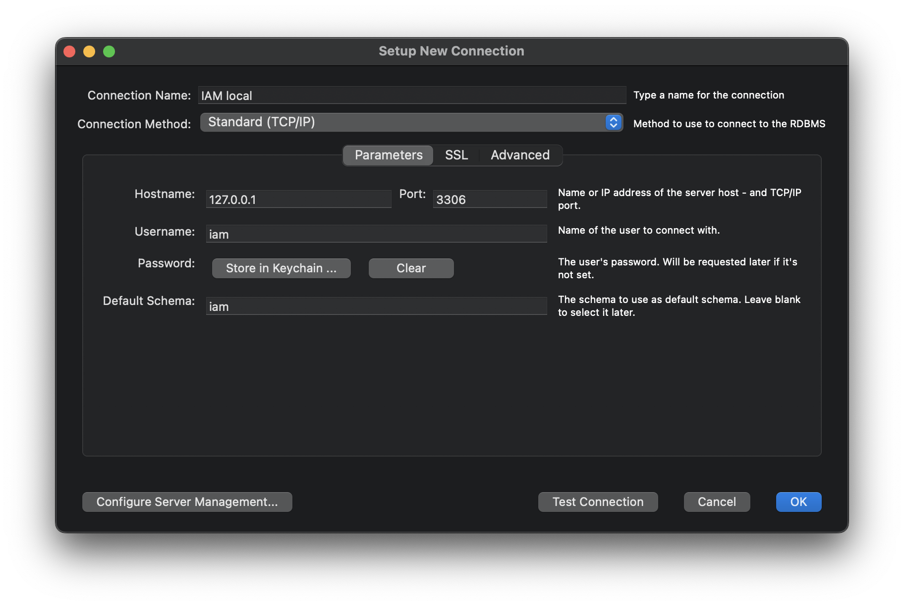

本プロジェクトの開発チームに参加した方向けのスタートガイドです。

## 開発で利用するソフトウェア

- [Docker Desktop](https://www.docker.com/products/docker-desktop)
  - ローカルで DB を構築する際などに利用します
  - `docker-compose`は Docker のサブコマンドとして統合されたのでインストール不要
- [MySQL Workbench](https://www.mysql.com/jp/products/workbench/)
  - SQL クライアント機能や DB モデリング機能を提供します
- [IntelliJ IDEA](https://www.jetbrains.com/ja-jp/idea/)
  - JVM 系言語で実装されているプロダクトの IDE として利用します
  - 別の IDE やエディタを利用していただいても結構ですが、ここでは IntelliJ IDEA を使う前提で解説しています

!!! 詳細は各プロダクトの技術スタックを確認してください

## IAM をローカル起動する

### 1. IAM サーバの起動

IAM は全プロダクトで横断的に利用される認証基盤のため、最初に環境構築します。

```shell
# リポジトリをclone
$ git clone git@github.com:membership-console/iam.git
$ cd iam

# DBを起動
$ docker compose up -d
```

DB が起動できたら、**Edit Configurations**から`IamApplication`を下記のように設定してください。

最後に緑色の三角アイコンをクリックして、サーバが起動できれば成功です。





IntelliJ IDEA ではなくターミナルから起動したい場合は、下記コマンドで代替可能です。

```sh
$ ./gradlew bootRun -Dspring.profiles.active=local
```

### 2. DB にテストデータを入れる

MySQL Workbench を起動し、下記のような Connection を作成してください。

この時、Username 及び Password は両方とも`iam`になります。



MySQL に接続できたら、[検証用データの作成](../開発用資料/検証用データの作成.md)を参考にテストユーザを作成すれば IAM のセットアップは完了です。
