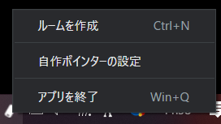
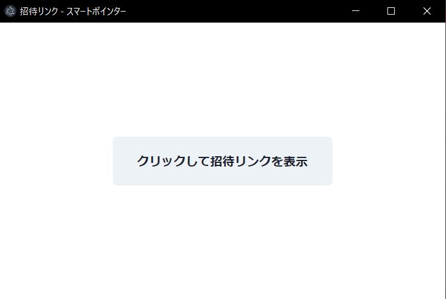
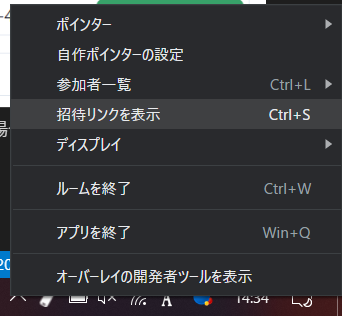

# ルーム作成と招待リンクの表示

## 概要

『スマートポインター』の機能を使うにはデスクトップアプリケーションで作成したルームにリモコン用Webアプリケーションから入室する必要があります．リモコン用Webアプリは同一ルームのPCに対して，レーザーポインターやスライド送りの機能を使用することができます．1つのPCに対して複数のリモコン用Webアプリから操作をすることができます．

招待リンクはリモコン用Webアプリがルームに入室する際に使用します．

## 手順

- デスクトップアプリケーションを起動します
- タスクトレイに表示されたスマートポインターのアイコンを右クリックし，メニューを開きます

- `ルームを作成`をクリックしルームを作成します
- ルームを作成すると以下のウィンドウが表示されるので，`クリックして招待リンクを表示`をクリックします

- 表示された招待リンクをリモコン用Webアプリで使用するスマートフォンに共有します

- 招待リンクのウィンドウを削除した後，再度表示する場合はメニューから`招待リンクの表示`を選択します

