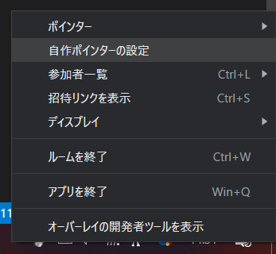
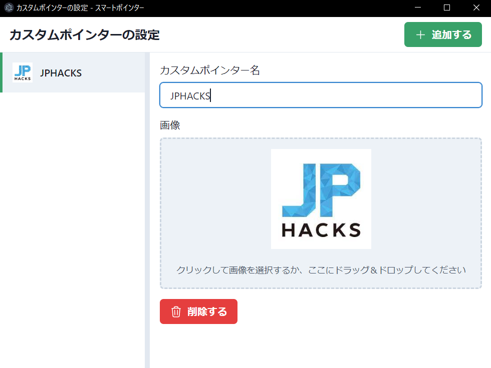
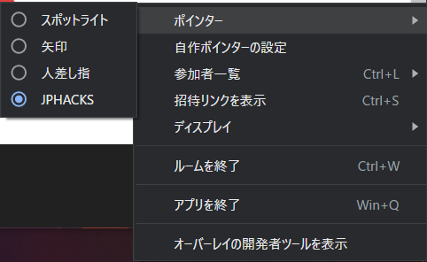

# カスタムポインターの作成

## 概要

『スマートポインター』で自前の画像をポインターのデザインとして使用するには，事前に画像を追加する必要があります．

## 手順

- ルームを作成した状態でタスクトレイにあるアイコンを右クリックしてメニューを開きます
- メニューから`自作ポインターの設定`を選択します

- 設定ウィンドウから`カスタムポインター名`を設定し，ポインターとして使用したい画像をアップロードします
  - 例
  
  - 2つ目以降は右上の`追加する`ボタンをクリックした後，同様の操作を行ってください
- 追加した画像はメニューの`ポインター`から選択することで使用できるようになります

