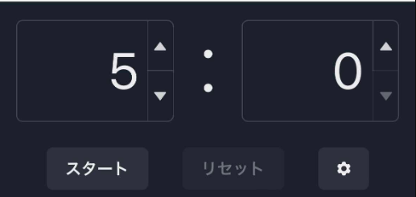
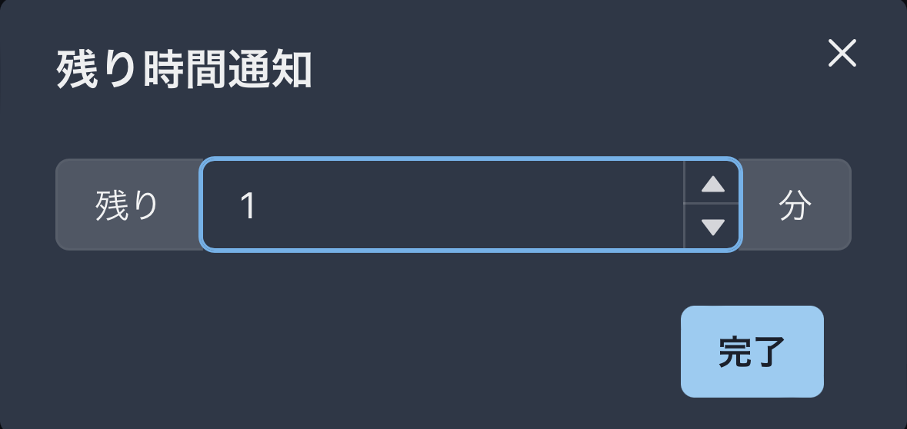

# タイマー

## 概要

『スマートポインター』にはタイマー機能が付いており，これを使うことでプレゼンの残り時間をスマートに管理することができます．タイマーの残り時間は同一ルームに参加しているリモコン用Webアプリ間で共有されます．

また，このタイマーでは残り時間通知を設定することができます．設定時間まで到達するとトースト通知されます．

## 残り時間通知の設定

- タイマー部右下の歯車ボタンをクリックします

- 通知してほしい残り時間を入力し，`完了`をクリックします

